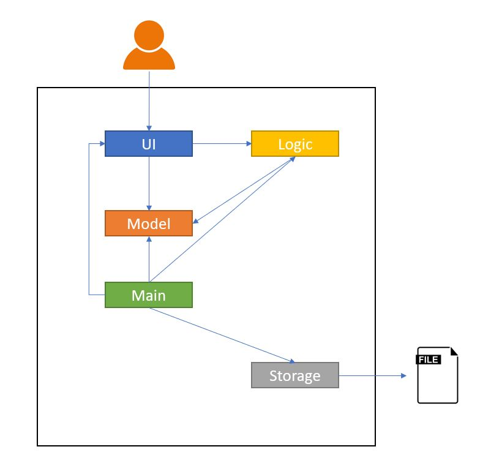
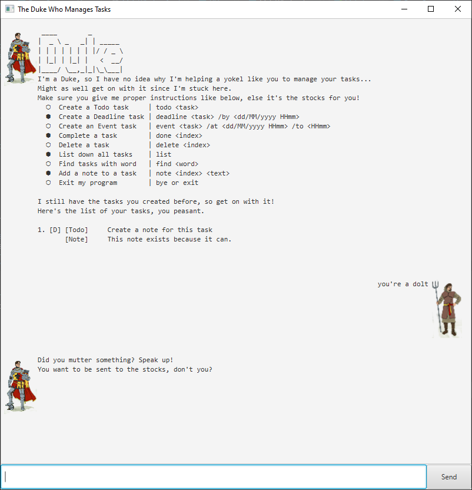
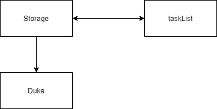

# Developer Guide
* [Setting Up and Getting Started](#Setting-Up-and-Getting-Started)
* [Design](#Design)
  * [Architecture](#Architecture)
  * [Storage component](#Storage-Component)
* [Appendix: Requirements](#Appendix:-Requirements)
  * [Product scope](#Product-scope)
  * [User stories](#User-Stories)
  * [Non-Functional Requirements](#Non-Functional-Requirements)
  * [Glossary](#Glossary)

<div style="page-break-after: always;"></div>

## Setting Up and Getting Started
:heavy_exclamation_mark: **Caution** Follow the steps in the following guide precisely. Things will not work out if you deviate in some steps.

First, **fork** this repo, and **clone** the fork into your computer.
If you plan to use Intellij IDEA (highly recommended):

1. **Configure the JDK:**
 * Ensure you have the correct JDK version installed in your computer.
 * Open IntelliJ (if you are not in the welcome screen, click ```File → Close Project``` to close the existing project dialog first).
 * Set up the correct JDK version for Gradle.
  * Click ```Configure → Project Defaults → Project Structure```
  * Click ```New…``` and set it to the directory of the JDK.
2. **Import the project as a Gradle project:**
 * IntelliJ IDEA by default has the Gradle plugin installed. If you have disabled it, go to ```File → Settings → Plugins``` to re-enable them.
 * If your project involves GUI programming, similarly ensure the JavaFX plugin has not been disabled.
 * Click ```Import Project``` (or Open or Import in newer version of Intellij).
 * Locate the ```build.gradle``` file (not the root folder as you would do in a normal importing) and select it. Click OK.
 * If asked, choose to Open as Project (not Open as File).
 * Click OK to accept the default settings but do ensure that the selected version of Gradle JVM matches the JDK being used for the project.
 * Wait for the importing process to finish (could take a few minutes).
 * :heavy_exclamation_mark: **Note**: Importing a Gradle project is slightly different from importing a normal Java project.
3. **Verify the setup:**
 * Run the ```java -jar NUS.Duke.Launcher.jar``` and try a few commands.
  
<div style="page-break-after: always;"></div>
  
## Design

##### Architecture


The ***Architecture Diagram*** shown gives an overview of the high-level design.

`Main` has a class file named `Launcher`, run the main class method in `Duke.java`. It would perform the following functions:

- At launch: Initialize the components in the correct sequence, and connect them up with each other.
- At shut down / Exit: Shuts down the components and invokes save / cleanup methods where necessary.


<div style="page-break-after: always;"></div>

The application then consists of four other components:

- `UI`: The UI of Duke.
- `Logic`: The command executor. 
- `Model`: Hold the data of events in memory.
- `Storage`: Read data from, and writes data to the hard disk.

One example would be the `Storage` component which defines its API in `ParseUtil.java, writeToFile() Function` as well as exposes its functionality using the same class.

##### UI Example



##### Storage Component
###### Storage(Load)


###### Storage(save)


API:  ```ParseUtil.java, writeToFile() Function```

The Storage Component,
* Load function will read the text file and passing the list of string in the file
to the decoding class. 

* Saving function will Encode the task detail and pass it back to storage
to save to the file. 

<div style="page-break-after: always;"></div>

## Appendix: Requirements
### Product scope
##### Target user profile

* Has a need to manage his/her task (deadline, events)
* Is able to use command line interface (CLI)
* Can type fast
* Prefers typing to interaction with a graphical user interface (GUI)
* Is comfortable using CLI commands with GUI view apps

##### Value proposition: 
To manage all tasks faster than a typical written down method

### User Stories
###### *Priorities: High (must have) - `* * *`, Medium (nice to have) - `* *`, Low (unlikely to have) - `*`*

|Priority|Version| As a ... | I want to ... | So that I can ...|
|--------|--------|----------|---------------|------------------|
|`* * *`|v1.0|Student|remind me to buy fruits|eat more healthy|
|`* * *`|v1.0|Student|remind me to attend school project meeting at meeting room|discuss project details|
|`* * *`|v1.0|Student|remind me to finish school work by friday night|submit assignment on time

<div style="page-break-after: always;"></div>

### Use Cases

###### (For all use cases below, the System is the `NUS Expenses Tracker` and the Actor is the `NUS Student`)


<div style="page-break-after: always;"></div>

### Non Functional Requirements

1. Should work on any mainstream OS as long it has Java ```11``` or above installed.
2. User will be able to interact with the systems with regular english text. For example: (```
add chicken rice $4.00 2020-11-01 /C FOOD. ```).
3. Will be able to handle up to 1000 expenses without noticeable slowness in performance for typical usage.
4. User will be able to interact with their expenses.txt if they wish to make amendment. 

### Glossary

- *MainStream OS* - Windows, Linux, Unix, OS-X
- NET - NUS Expenses Tracker
- Regex - Regular Expressions
- JDK - Java Development Kit - [Java SE](https://www.oracle.com/sg/java/technologies/javase-downloads.html "Java SE Downloads")
- Gradle - Gradle Build Tool - [Gradle User Manual](https://docs.gradle.org/current/userguide/userguide.html "Build Automation Tool - Docs")
- Intellij / IDE - Intellij Integrated Development Environment - [IntelliJ IDEA](https://www.jetbrains.com/idea/ "JVM IDE") 
- Plugin - IDE Plugins - [Intellij IDEA Plugins](https://www.jetbrains.com/help/idea/managing-plugins.html "Manage plugins")