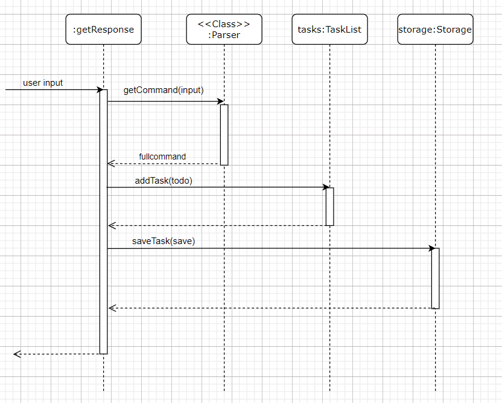
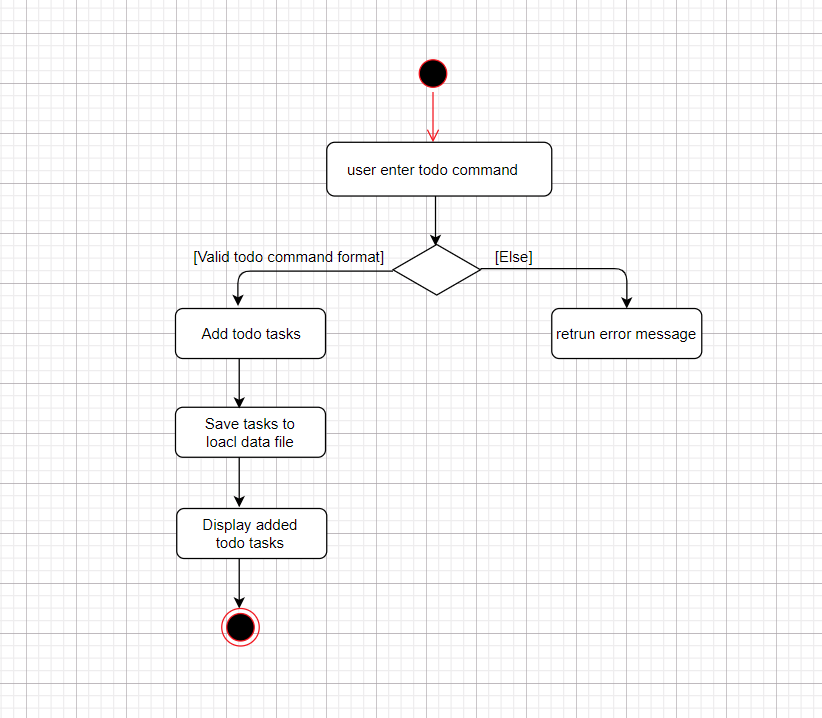

# Developer Guide

## Implementation of Todo Feature
The `todo` feature implemented using `Todo`, which extends `Task`.
Upon receiving an input string that has `todo` as the first word, the `Duke` object will instantiate a
`Todo` object with the `fullCommand` string, which is the input entered by the user. The `Duke`
object will then call the `getResponse` method in the `Todo` object with the `user input` arguments:

Finally, the `getResponse` method will execute the following steps:
1. Calls `Parser#getCommand(fullCommand)` to get an `Todo` object `todo`;
2. Calls `tasks#addTask(todo)` to add `todo` to `tasks`;
3. Calls `storage#saveTasks(tasks)` to save all tasks to data file;

The following sequence diagram shows the object interactions when the `Duke` object calls the `getResponse` method
of the `Todo` object:

The following activity diagram shows what happens when a user enters a `todo` command:

## User Stories

|Version| As a ... | I want to ... | So that I can ...|
|--------|----------|---------------|------------------|
|v0.1|new user|add a todo task with no deadline|be reminded to do this task|
|v0.1|new user|add a deadline task with deadline|be reminded to do this task before the deadline|
|v0.1|new user|add a event task with address|be reminded to do this task at correct address|
|v0.1|new user|list all tasks|view my assigned tasks|
|v0.2|user|find tasks|view specific tasks of interest|
|v0.2|user|mark a task as done|know which of the tasks are completed|
|v0.2|user|delete a task|remove a task that is no longer needed|
|v0.2|user|save all tasks|save all tasks to my local folder|
|v0.3|user|check the use help manual|learn how to use the app quickly and easily|

## Non-Functional Requirements

1. The application should work on any mainstream OS with Java `11` or above installed.
2. The response time for each command should not exceed `3` seconds.
3. The average typing speed user should be able to enter any one command within `10` seconds.
4. The application GUI should be easily and clearly.

## Glossary

* *Mainstream OS* - Windows 7, Windows 10, Linux, Unix, OS-X