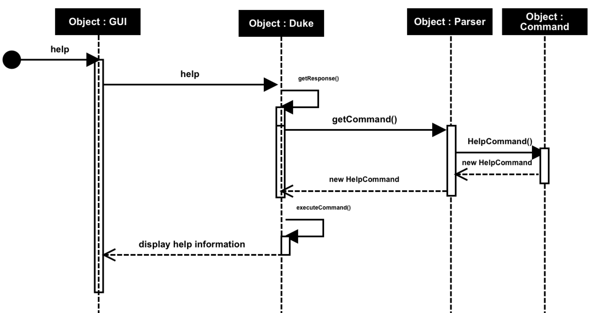

# Developer Guide

## Design
Duke uses commands and JAVAFX to interact with users to manage their daily tasks,you can refer to [online website](https://yiheng0410.github.io/ip/DeveloperGuide.html).

## Sequence Diagram

## Product scope
### Target user profile

Duke will be useful for users with a lot daily tasks to complete, like students, working professionals, housewife etc.

### Value proposition

Duke will help users to keep track and manage their daily tasks easily and effectively.

## User Stories

|Version| As a ... | I want to ... | So that I can ...|
|--------|----------|---------------|------------------|
|v1.0|new user|add some task|have a list of my tasks|
|v1.0|new user|add task with a deadline|know when to complete the task|
|v2.0|existing user|mark the task as completed|know the status of the tasks |
|v2.0|existing user|delete a task |keep my task list up to date|
|v2.0|existing user|find a task based on certain key word |look for a task quickly|
|v3.0|existing user|view the full list of my tasks|have a quick view of all my tasks|
|v3.0|existing user|view some commands|know how to use the app in case I forget the command|

## Non-Functional Requirements

* Operation Environment: Project Duke works on any Mainstream OS as long as it has Java **11** or above installed. 
* Usability: A command line based with JavaFX interface application, user will use specified command to interact with the system.
* Capacity: Project Duke should be able to record at least 1,000 project records. 
* Reliability / Availability: Once the project Duke has been successfully deployed on user's computer, availability is 24/7.   
* Scalability: The current version of project Duke only support local data file storage, users are unable to share a centralised project data.
               If the need of having a centralised data storage raised in the future, it can be added as system enhancement. 
* Security: User login is being not required by user. The project Duke use user's computer login as authentication.
* Maintainability: A updated JAR file will be released to user if there is any update to the current version of the project tracker.                 
               
## Glossary

* Mainstream OS * - Windows, Mac and Linux

## Instructions for manual testing

1. Start the program
*    1. Download the Jar file and copy into an empty folder
*    2. Use terminal/CMD to run jar file with `java -jar` command.

2. Adding a todo/deadline/event task
*    Follow instruction in README.md

3. Delete a task
*    Follow instruction in README.md

3. Find a task 
*    Follow instruction in README.md

4. View task List 
*    Follow instruction in README.md

4. Exit the program
*    Type exit command or double enter to exit the program.