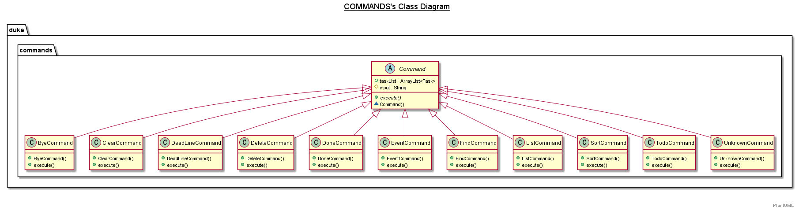
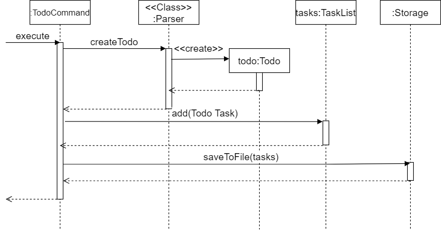

# Developer Guide

--------------------------------------------------------------------------------------------------------------------

## **Design**
### Architecture

The ***Architecture Diagram*** given above explains the high-level design of the App. Given below is a quick overview of each component.

The rest of the App consists of four components.

* [**`UI`**]: The UI of the App.
* [**`Util`**]: (Storage) Reads data from, and writes data to, the hard disk. (Tasklist) Contains multiple tasks.
* [**`Command`**]: Handles various commands.
* [**`Tasks`**]: Holds the tasks related records such as todo, event, deadline.
* [**`Exceptions`**]: The exception executor.
* [**`Parser`**]: The parser executor.

### UML: Class Diagram
The image below shows the example of the interaction of command (e.g list, sort, bye, clear, etc).
 

The image below shows the example of the interaction of task (e.g todo, event, deadline).
 

### Todo feature
#### Implementation of todo feature
These operations are exposed in the `TodoCommand()` class.
* Step 1: The user executes the todo command.
* Step 2: The TodoCommand() class will parser the todo keywords to see if it is a valid command.
* Step 3: If it is valid, then create a todo task. Otherwise, show an error message.
* Step 4: Add this newly created todo task to the task list.
* Step 5: Then save the updated task list to storge.

#### UML: Sequence Diagram
The image below shows the example of the interaction of todo command.
 

#### UML: Activity Diagram
The image below shows the example of the interaction of todo command.
 

--------------------------------------------------------------------------------------------------------------------

## **Appendix: Requirements**
### Product scope

**Target user profile**: This app is targeted towards any user who wish to keep track of tasks.

**Value proposition**: This app shall allow users to manage tasks to track their progress.
This helps them to manage their tasks and make timely adjustments to their habits when necessary.

Priorities: High (must have) - `* * *`, Medium (nice to have) - `* *`, Low (unlikely to have) - `*`

| Priority | As a …​                                    | I want to …​                                | So that I can…​                                             |
| -------- | ---------- | ------------------------------------------------ | ---------------------------------------------------------------------- |
| `* * *`  | user    | add a todo task record               | keep track of a particular todo task                        |
| `* * *`  | user    | add a event task record               | keep track of a particular event task                        |
| `* * *`  | user    | add a deadline task record             | keep track of a particular deadline task                        |
|`* * *`   | user    |list my tasks                         |view all my tasks|
|`* * *`   | user    |clear all my tasks                         |start afresh with the app|
| `* * *`  | user    | delete a task record                      | remove a task record that I no longer need                        |
| `* * *`  | user     | find a task record                  | look at the particular task's information                          |
| `* * *`  | user     | sort task records by task status, task description | see task in a proper sequence                         |
| `* * *`  | user     | mark task records as done | label tasks which have been completed                         |

### Non-Functional Requirements

1. The app should work on any mainstream OS with Java `11` or above installed.
2. The response time for each command should not exceed `3` seconds.
3. A user with average typing speed should be able to enter any one command within `12` seconds.
4. After using each command for at least `5` times, a user with no cognitive disability should be able to
   use all the app features without having to reference the user guide.

### Glossary

* *Mainstream OS* - Windows 7, Windows 10, Linux, Unix, OS-X

--------------------------------------------------------------------------------------------------------------------

## **Appendix: Instructions for manual testing**

Given below are instructions to test the app manually.

:information_source: **Note:** These instructions only provide a starting point for testers to work on;
testers are expected to do more *exploratory* testing.

### Launch and shutdown

1. Initial launch

    1. Download the jar file and copy into an empty folder

    1. Double-click the jar file Expected: Shows the GUI with a set of sample contacts. The window size may not be optimum.

1. Saving window preferences

    1. Resize the window to an optimum size. Move the window to a different location. Close the window.

    1. Re-launch the app by double-clicking the jar file. 
       Expected: The most recent window size and location is retained.

### Deleting a task

1. Deleting a task while all tasks are being shown

    1. Prerequisites: List all tasks using the `list` command. Multiple tasks in the list.

    1. Test case: `delete 1` 
       Expected: First task is deleted from the list. Details of the deleted task shown in the status message. Timestamp in the status bar is updated.

    1. Test case: `delete 0` 
       Expected: No task is deleted. Error details shown in the status message. Status bar remains the same.

    1. Other incorrect delete commands to try: `delete x`, `...` (where x is larger than the list size) 
       Expected: Similar to previous.

### Finding a task
1. Finding a task based on the key information
    1. Prerequisites: There shall be some tasks in the lists so that the system can return some results.
    1. Test case: `find <KEYWORD>` 
      Expected: The tasks contain the specific keyword will be found and shown to the user.

### Adding a task
1. Adding different kinds of tasks such as todo, deadline, event task
1. Using the command as followings:
    1. Adds a Todo task. ToDos: tasks without any date/time attached to it `e.g., visit new theme park`.  
       Format: `todo` **TASK DESCRIPTIONS**
    1. Adds a Deadline task. Deadlines: tasks that need to be done before a specific date `e.g., submit report by 2020-10-23`  
       Format: `deadline` **TASK DESCRIPTIONS** `/by` **SPECIFIC DATE** (FORMAT:yyyy-MM-dd)
    1. Adds an Event task. Events: tasks that start at a specific time and ends at a specific time `e.g., team project meeting at 2020-10-23 10:00` 
       Format: `event` **TASK DESCRIPTIONS** `/at` **SPECIFIC DATE AND TIME** (FORMAT:yyyy-MM-dd'T'HH:mm)
