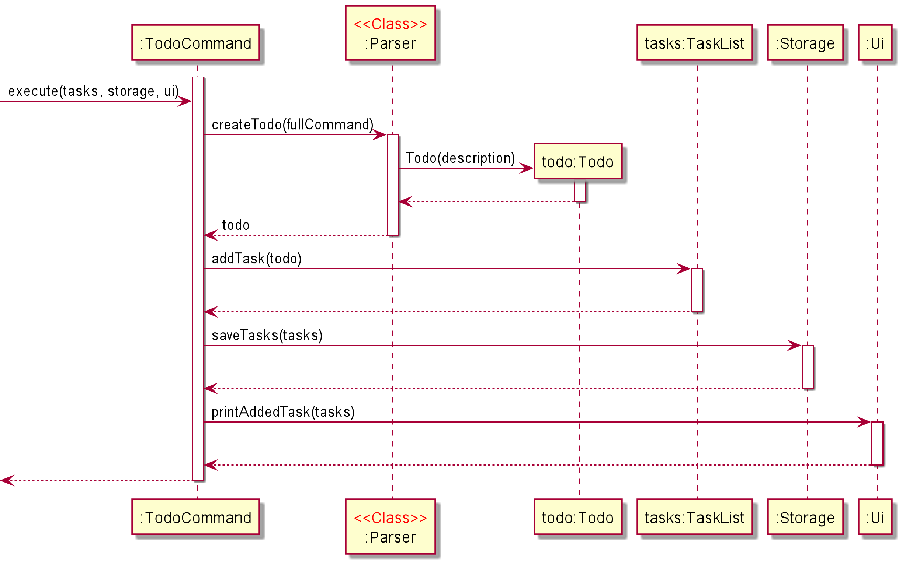

# Developer Guide

## Implementation of Features
This section describes how certain features are implemented.

## Implementation of Todo Feature
The `todo` feature is implemented using `TodoCommand`, which extends `Command`.
Upon receiving an input string that has `todo` as the first word, the `Duke` object will instantiate a
`TodoCommand` object with the `fullCommand` string, which is the input entered by the user. The `Duke`
object will then call the `execute` method in the `TodoCommand` object with the following arguments:
1. `tasks`: a `TaskList` object;
2. `ui`: a `Ui` object;
3. `storage`: a `Storage` object;

Finally, the `execute` method will execute the following steps:
1. Calls `Parser#createTodo(fullCommand)` to get an `Todo` object `todo`;
2. Calls `tasks#addTask(todo)` to add `todo` to `tasks`;
3. Calls `storage#saveTasks(tasks)` to save all tasks to data file;
4. Calls `ui#printAddedTask(tasks)` to generate the output string that will be shown to the user.

The following sequence diagram shows the object interactions when the `Duke` object calls the `execute` method
of the `TodoCommand` object:
  

The following activity diagram shows what happens when a user executes a `todo` command:
  

## User Stories

|Version| As a ... | I want to ... | So that I can ...|
|--------|----------|---------------|------------------|
|v0.1|new user|add a task with no deadline|be reminded to do this task|
|v0.1|new user|add a task with deadline|be reminded to do this task before the deadline|
|v0.1|new user|add a task with start datetime and duration|be reminded to do this task during its timeslot|
|v0.1|new user|list all tasks|view my assigned tasks|
|v0.1|user|find tasks|view specific tasks of interest|
|v0.1|user|mark a task as done|know which of the tasks are completed|
|v0.1|user|delete a task|remove a task that is no longer needed|
|v0.4|user|sort all tasks|order my tasks based on their deadline|

## Non-Functional Requirements

1. The app should work on any mainstream OS with Java `11` or above installed.
2. The response time for each command should not exceed `3` seconds.
3. A user with average typing speed should be able to enter any one command within `12` seconds.
4. After using each command for at least `5` times, a user with no cognitive disability should be able to
   use all the app features without having to reference the user guide.

## Glossary

* *Mainstream OS* - Windows 7, Windows 10, Linux, Unix, OS-X

