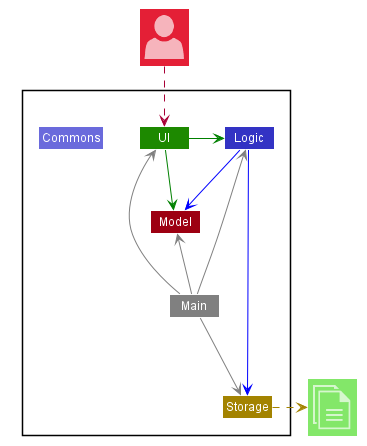

# Developer Guide

* [Setting up, getting started](#Setting-Up-and-Getting Started)
* [Design](#Design)
    * [Architecture](#Architecture)
    * UI component
    * Storage component
    * Common classes
* [Implementation](#Implementation)
    * [Appendix: Requirements](#Appendix:-Requirements)
        * [Product Scope](#Product-Scope)
        * [User Stories](#User-Stories)
        * [Use Cases](#Use-Cases)
        * [Non-Functional Requirements](#Non-Functional-Requirements)
        * [Glossary](#Glossary)
    * [Appendix: Instructions for manual testing](#Appendix:-Instructions-for-manual-testing)
        * Launch and shutdown
        * Add a task
        * Tag a task
---
## Setting Up and Getting Started
**Caution** Follow the steps in the following guide precisely. Things will not work out if you deviate in some steps.

First, **fork** this repo, and **clone** the fork into your computer.
If you plan to use Intellij IDEA (highly recommended):

1. **Configure the JDK:**
* Ensure you have the correct JDK version installed in your computer. **([JDK 11 & above!](https://www.oracle.com/sg/java/technologies/javase-jdk11-downloads.html))**
* Open IntelliJ (if you are not in the welcome screen, click ```File → Close Project``` to close the existing project dialog first).
* Set up the correct JDK version for Gradle.
* Click ```Configure → Project Defaults → Project Structure```
* Click ```New…``` and set it to the directory of the JDK.
2. **Import the project as a Gradle project:**
* IntelliJ IDEA by default has the Gradle plugin installed. If you have disabled it, go to ```File → Settings → Plugins``` to re-enable them.
* If your project involves GUI programming, similarly ensure the JavaFX plugin has not been disabled.
* Click ```Import Project``` (or Open or Import in newer version of Intellij).
* Locate the ```build.gradle``` file (not the root folder as you would do in a normal importing) and select it. Click OK.
* If asked, choose to Open as Project (not Open as File).
* Click OK to accept the default settings but do ensure that the selected version of Gradle JVM matches the JDK being used for the project.
* Wait for the importing process to finish (could take a few minutes).
* **Note**: Importing a Gradle project is slightly different from importing a normal Java project.
3. **Verify the setup:**
* Run the ```java -jar A0177810A_Duke.jar``` and try a few commands.
---
## Design

### Architecture


The Architecture diagram above gives an overview of the high-level design.

`Duke` is the main class.

* At launch: Initialize the components in the correct sequence, and connect them up with each other.
* At shut down / Exit: Shuts down the components and invokes save / cleanup methods where necessary.

`Commons` holds a collection of frequently used static messages used by multiple other components.

* UI - The UI of the application.
* Logic - The logic handler of the application.
* Storage - Reads data from, and writes to the file / storage disk.
* Tasklist - Holds the program memory / in-memory data of the application.
* Parser - Parses user input.
* Controller - Control the style and display of the GUI.

### Implementation
#### Component Interaction
###### Find Feature Sequence Diagram


The above Sequence Diagram shows the component interaction for the scenario where the user inputs `find keyword`.

###### Storage Class Diagram


The Storage Component:

* Load function will read the text file and parse the list in the file.
* The Tasks will be parse and then loaded into the in-memory TaskList.

---
### Appendix: Requirements

#### Product Scope
##### Target User: Students
* Prefer typing to interaction with a mouse.
* Can type fast and prefer CLI type interaction with a minimal GUI.
* Wants to manage tasks/ schedule using an application.
* Is comfortable interacting with CLI / GUI applications.

#### User Stories
###### *Priorities: High (must have) - `* * *`, Medium (nice to have) - `* *`, Low (unlikely to have) - `*`*

|Priority|Version| As a ... | I want to ... | So that I can ...|
|--------|--------|----------|---------------|------------------|
|`* * *`|v1.0|Student|add a task|track various tasks daily/ monthly/ weekly|
|`* * *`|v1.0|Student|view a list of tasks|reference current tasks added and am aware of them|
|`* * *`|v1.0|Student|remove a task|remove unwanted tasks and or re-add them as needed
|`* * *`|v1.0|Student|view a help page|reference the commands needed to interact with the application
|`* * *`|v1.0|Student|mark a task as complete / incomplete| be aware of the task's completion status
|`* * *`|v1.0|Student|save my list of tasks|have a persistent list of tasks that I can modify as necessary
|`* * `|v1.0|Student|find a task using a keyword| find a task using partial or full keywords
|`* * `|v1.0|Student|add a event| be aware of upcoming or past events
|`* * `|v1.0|Student|add a deadline| be aware of upcoming or past deadlines

#### Use Cases


#### Non-Functional Requirements

* Should work on any mainstream OS with Java 11 or above installed.
* Should hold up to 1000 tasks without noticeable decline in performance.
* The GUI / CLI interface should be intuitive, and user friendly.
* All tasks should be loaded from and saved to a plain text file (.txt).

#### Glossary
* Mainstream OS* - Windows 7, 8 , 10 / Linux distros (Ubuntu, RHEL, CentOS) / MacOS
* CLI - Command Line Interface
* GUI - Graphical User Interface
* JDK - Java Development Kit
* Gradle - Gradle Build Tool
* Intellij / IDE - Intellij Integrated Development Environment

---
### Appendix: Instructions for manual testing

1. Launch
    1. Download the ```A0177810A_Duke.jar``` into preferred directory/ folder.
    1. Open terminal / command prompt window and type ```java -jar A0177810A_Duke.jar```
    1. A GUI window should appear.
    
1. Shutdown
    1. Close the app using the close button `[X]` at the top right, or type `exit` and press enter.
    
1. Add a Task
    1. While the application GUI window is open, type `todo [task description without brackets]` and press enter
        1. E.g. ```todo return textbook```
    
1. Tag a task
    1. While the application is open, and **with tasks added**, type ```tag [Task index number according to list] #[tag description without brackets]``` and press enter.
        1. ```E.g. tag 1  #Chore``` **Add # right before the description text**.

