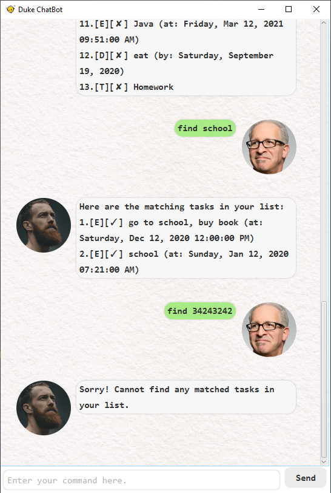
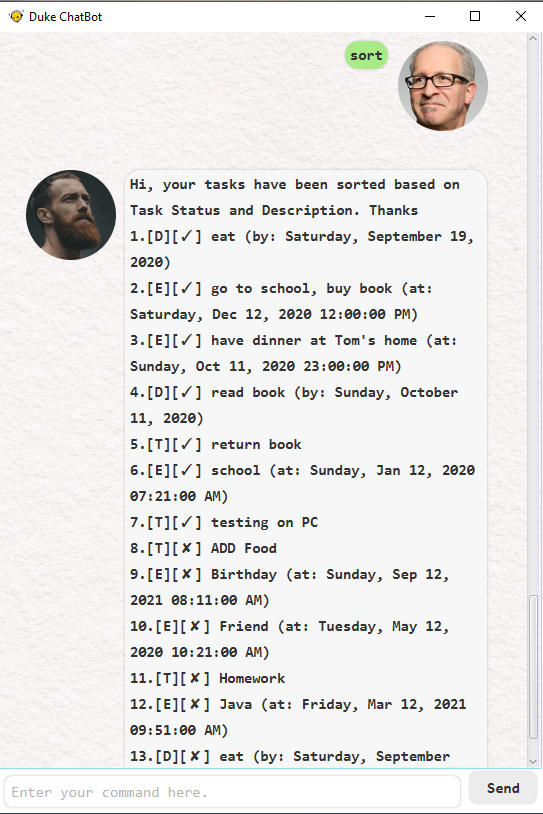

# Duke

It is an application for managing tasks. Also it has a Graphical User Interface (GUI) for user to enter command.

Useful links:
* [User Guide](UserGuide.md)
* [Developer Guide](DeveloperGuide.md)
* [Screenshots](images)
