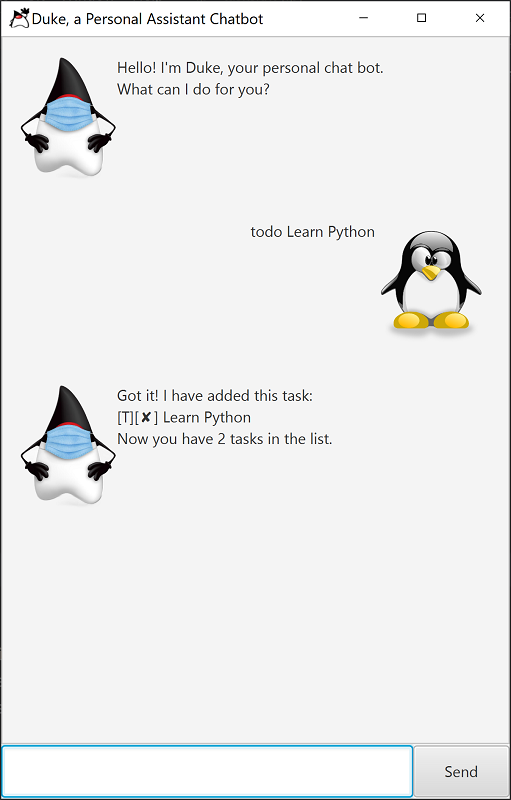

# Duke project

Duke is a Java-based desktop app that helps the users keep track of the tasks they need to do. It comes with a Command Line Interface (CLI) that allows users to enter their commands while retaining the benefits of a Graphical User Interface (GUI). This allows users who type fast to complete their desired actions quicker than using traditional GUI apps.

Useful links:
* [User Guide](https://github.com/linqing42/ip/blob/master/docs/UserGuide.md)
* [Developer Guide](https://github.com/linqing42/ip/blob/master/docs/DeveloperGuide.md)
* [User Guide](website version)(https://linqing42.github.io/ip/UserGuide.html)
* [Developer Guide](website version)(https://linqing42.github.io/ip/DeveloperGuide.html)
* [Ui.png](website version)(https://linqing42.github.io/ip/Ui.png)

