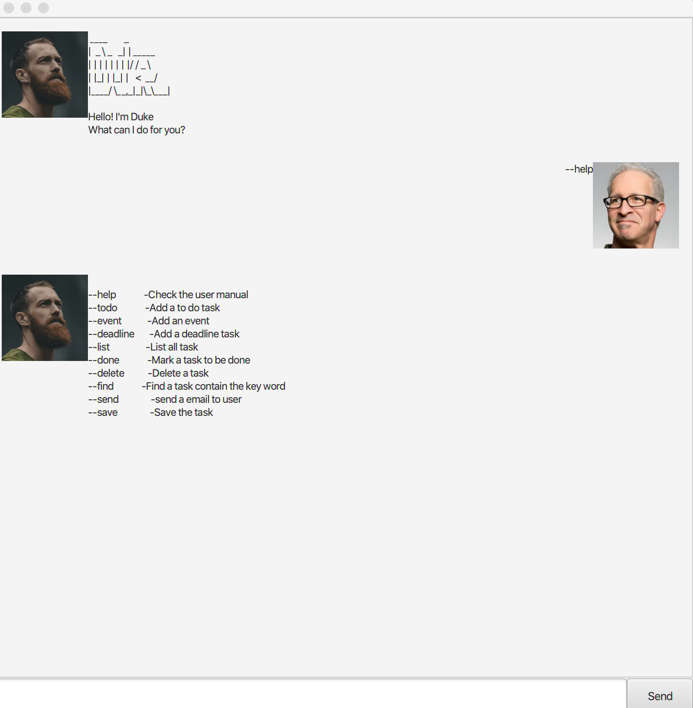

# User Guide - The Duke Who Manages Tasks

A Personal Assistant Chatbot that helps a person to keep track of various things. It's named after the Java mascot _Duke_. Given below are instructions on how to use it.

## Setting up in Intellij

Prerequisites: JDK 11, update Intellij to the most recent version.

1. Open Intellij (if you are not in the welcome screen, click: `File` >: `Close Project` to close the existing project dialog first)
1. Set up the correct JDK version, as follows:
   1. Click: `Configure` >: `Structure for New Projects` and then: `Project Settings` >: `Project` >: `Project SDK`
   1. If JDK 11 is listed in the drop down, select it. If it is not, click: `New...` and select the directory where you installed JDK 11
   1. Click: `OK`
1. Import the project into Intellij as follows:
   1. Click: `Open or Import`.
   1. Select the project directory, and click: `OK`
   1. If there are any further prompts, accept the defaults.
1. After the importing is complete, locate the: `src/main/java/Launcher.java` file, right-click it, and choose: `Run Launcher.main()`. If the setup is correct, you should see something like the below:
   
   

## Features  
  - Command line manual    : `help`
  - Create a Todo task     : `todo`
  - Create a Deadline task : `deadline`
  - Create an Event task   : `event`
  - Complete a task        : `done`
  - Delete a task          : `delete`
  - List all tasks         : `list`
  - Find tasks with word   : `find`
  - send a email to user   : `send`
  - Save the task          : `save`
  
 #### Help    : `help`
 A mannul to guide the user.
 
 Format: `--help`
 
 Examples:
 - `--help`
    
 #### Create a Todo task    : `todo`
 Creates a Todo task and adds it to the task list.
 
 Format: `--todo --description INPUT --date dd/mm/yyyy hhmm -email xxxxx@gmail.com`
 - description, date and email must fill up.
 - date and email must be in a valid format.
 
 Examples:
 - `--todo --description going to school --date 12/12/2001 0800 -email hellokitty@gmail.com`
 
 #### Create a Deadline task: `deadline`
 Creates a Deadline task and adds it to the task list.
 
 Format: `--deadline --description INPUT --date dd/mm/yyyy hhmm -email xxxxx@gmail.com`
 - description, date and email must fill up.
 - date and email must be in a valid format.
 
 Examples:
 - `--deadline --description finish on homework --date 12/2/2002 1900 -email hellokitty@gmail.com`
 
 #### Create an Event task  : `event`
 Creates an Event task and adds it to the task list.
 
 Format: `--event --description INPUT --date dd/mm/yyyy hhmm -email xxxxx@gmail.com`
 - description, date and email must fill up.
 - date and email must be in a valid format.
  
 Examples:
 - `--event --description TV show --date 12/2/2002 2000 -email hellokitty@gmail.com`
 
 #### Complete a task       : `done`
 Completes a task and sets its status to D for Done.
 
 Format: `--done <index>`
 - The first task starts from index number 1 and so on.
 - Only numeric allow
   
 Examples:
 - `done 2`
 
 #### Delete a task         : `delete`
 Removes a task and its note from the task list and shifts the remaining tasks accordingly.
 
 Format: `--delete <index>`
 - Only numeric allow
 
 Examples:
 - `delete 1`
 
 #### List down all tasks   : `list`
 Lists down all tasks in the task list.
 
 Format: `--list`
 
 #### Find tasks with word  : `find`
 Finds all tasks that matches with the search word(s).
 
 Format: `--find --<keyword>`
 - `find` command apply on all the data in the database as long the keyword is matched.

 Examples:
 - `--find TV`
 - `--find 28/12`
 - `--find hellokitty@hotmail.com`
 
 #### Add a note to a task  : `send`
 Send a email of the task to user when the due date last than 7 days for reminder or sending a email of the task to user for record purpose.
 
 Format: `--send <index>`

 Examples:
 - `--send 1`
 
 #### Exit the program       : `save`
 save all the new changes to txt file.
 IMPORTANT: Please always save your changes before you close. If not nothing will be record.
 
 Format: `--save`
 
 ## Command Summary
 Action | Format, Examples
 ------------ | -------------
 **help**|`--help`
 **todo**|`--todo --description INPUT --date dd/mm/yyyy hhmm -email xxxxx@gmail.com`   e.g. `--todo --description going to school --date 12/12/2001 0800 -email hellokitty@gmail.com`
 **deadline**|`--deadline --description INPUT --date dd/mm/yyyy hhmm -email xxxxx@gmail.com`   e.g. `--deadline --description going to school --date 12/12/2001 0800 -email hellokitty@gmail.com`
 **event**|`--event --description INPUT --date dd/mm/yyyy hhmm -email xxxxx@gmail.com`   e.g. `--event --description going to school --date 12/12/2001 0800 -email hellokitty@gmail.com`
 **done**|`--done <index>`   e.g. `--done 1`
 **delete**|`--delete <index>`   e.g. `--delete 1`
 **list**|`--list`
 **find**|`--find <keyword>`   e.g.   `--find TV`   `--find 28/11`   `--find hellokitty@hotmail.com`
 **send**|`--send <index>`   e.g.   `--send 1`
 **save**|`--save`
