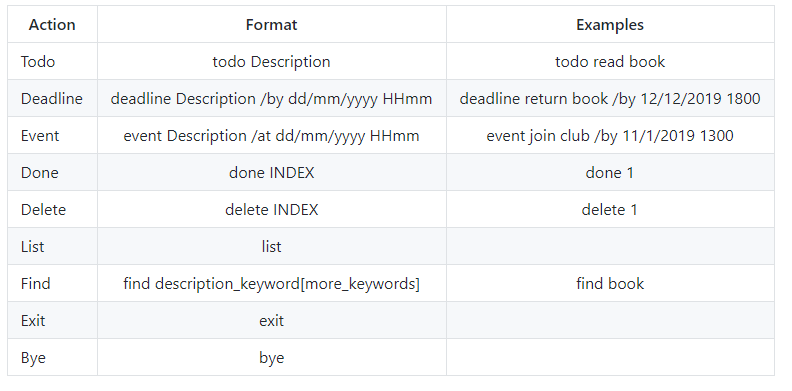

# User Guide
This product is an educational software project that helps user to keep track of various things.
<br/> The link is [website for user guide ](https://linqing42.github.io/ip/UserGuide.html)

## Quick start 
Using IntelliJ
1. Ensure you have Java 11 or above installed in your Computer
1. Download the IntelliJ
1. Set up the correct JDK version as follows:
   1. Click `Configure` > `Structure for New Projects` and then `Project Settings` > `Project` > `Project SDK`
   1. If JDK 11 is listed in the drop down, select it. If it is not, click `New...` and select the directory where you installed JDK 11
   1. Click `OK`
1. Download the latest project from [here](https://github.com/linqing42/ip).
1. Import the project into Intellij.
1. Go to the sr folder and find src\main\java\dukes\dukes.Duke
1. Right click the dukes.Duke and select Run dukes.Launcher
1. The program now should run on the Console (usually located at the bottom side)
1. Type the command and press Enter to execute it.<br>
1.Refer to teh [Feature](#features) below for details of each command.

Using Command Line
1.	'Build' the project using IntelliJ.
1.	Open the Terminal/Command Prompt.
1.	cd into the project’s `out\artifacts\ip_jar`.
1.	Type `java -jar ip.jar`  then Enter to execute .
1.	Now you can interact with the program through the CLI.

## Features 
- See all commands format : help
- Adding a Todo task: todo
- Adding a Deadline task: deadline
- Adding an Event task: event
- Listing task information: list
- Finding all tasks containing any keyword: find
- Deleting a task : delete
- Mark as Done of a task: done
- View details of a task : view
- Exiting the program : bye
- Loading the data
- Saving the data

Notes about the command format:
- Words in **UPPER_CASE** are the parameters to be supplied by the user.
`E.g. DESCRIPTIONS in the command todo TASK DESCRIPTIONS`.
Order of parameters fixed.

### Viewing help: `help`

## Usage
Shows all available commands that the user can input.

**Format**: `help`

**Example of usage**: 
<br/>help

**Expected outcome**:
```
Use following commands to control me:
     - todo [desc]\n"
     - event [desc] /at [date time]
     - deadline [desc] /by [date time]
     - list\n"
     - done [task number]
     - bye|exit (exits duke)
     - find [keyword]
     * date format - DD/MM/YYYY 
     * time format - HHmm
```

### Adding a task: `todo`

## Usage
Adding a task in the task list and show the total number of task in the list.

### `todo` - Adding a task into a task list.
<br/>>The keyword 'todo' with description can be **upper and lowercase letters** and its outcome will not include the keyword.
<br/>>If you key in the keyword without description. There will be an error message:"OOPS!!! The description of a todo cannot be empty. "

**Format**: `todo` Description

**Example of usage**: 
<br/>TOdo Read BOOK

**Expected outcome**:
```
Got it. I've added this task: 
[T][X] Read book
Now you have 1 task in the list.
```

### Adding a deadline task: deadline

## Usage
Adding a deadline task helps to know the deadline for the specific task in the task list and show the total number of task in the list.

### `deadline` - Adding a deadline task
<br/>>The keyword 'deadline' with description can be **upper and lowercase letters** and the outcome will not include the keyword.
<br/>>The date and time format need to include.
<br/>>If you key in the keyword without description. There will be an error message:"OOPS!!! The description of a deadline cannot be empty." 
<br/>>If you forgot to include the date and time or /by, there will be reminder message:"OOPS!!! Please refer to [Help] to key in Correct Format."
<br/>>If you key in a wrong format for date and time. There will be message to guide you :"Please input a date in this format : dd/MM/yyyy HHmm."

**Format**: `deadline` Description /by dd/mm/yyyy HHmm

**Example of usage**:
<br/>deadline return book /by 12/12/2021 1800

**Expected outcome**:
```
Got it. I've added this task: 
[D][X] return book (by:12-Dec-2021 06:00 PM)
Now you have 2 tasks in the list.
```

### Adding an event task: `event`

## Usage
Adding an event task helps to remind the user to attend the event with specific date and time in the task list and show the total number of task in the list.

### `event` - Adding an event task
<br/>>The keyword 'event' with description can be **upper and lowercase letters** and The outcome will not include the keyword.
<br/>>TThe date and time format need to include.
<br/>>If you key in the keyword without description. There will be an error message:"OOPS!!! The description of an event cannot be empty."
<br/>>If you miss the date and time or /at, there will be reminder message:""OOPS!!! Please refer to [Help] to key in Correct Format."
<br/>>If you key in a wrong format for date and time. There will be message to guide you :"Please input a date in this format : dd/MM/yyyy HHmm."

**Format**: `event` Description /at dd/mm/yyyy HHmm

**Example of usage**:
<br/>EVENT join club /at 12/11/2021 0900

**Expected outcome**:
```
Got it. I've added this task: 
[E][X] join club (at:12-Nov-2021, 09:00 AM)
Now you have 3 tasks in the list.
```

### Marking a specific task: `done`

## Usage
Marking a specific task to remind the user that he has finished the task.

### `done` - Marking a specific task from the task list.
<br/>>The keyword 'done' can be **upper and lowercase letters** 
<br/>>The outcome will be change X to Y in the specific task.
<br/>>The index refers to the index number shown in the displayed task list.
<br/>>the index **must be positive integer** 1,2,3... and must be in the list.
<br/>>If you key in the keyword without INDEX. There will be an error message:"OOPS!!! Please refer to [Help] to key in Correct Format." 
<br/>>If you key in the index number that is out of the list. There will be an error message :"OOPS!!! There is no specific task number in the list."

**Format**: `done` INDEX

**Example of usage**: 
<br/>Done 1 or DONE 1 or done 1

**Expected outcome**:
```
<br/>Nice! I've marked this task as done:
<br/>[T][Y] Read book
```
### Deleting a task: `delete`

## Usage
Delete a specific task from task list to helps remove the completed task and tidy the task list. It will show the total number of Tasks left in the task list. 

### `delete` - Deleting a specific task from the task list.
<br/>>The keyword 'delete' can be **upper and lowercase letters** and its outcome will be remove the specific task and reduce the total number of task in the list.
<br/>>The index refers to the index number shown in the displayed task list 
<br/>>The index **must be a positive integer** 1,2,3... and must be in the list.
<br/>>If you key in the index number that is out of the list. There will be an error message:"OOPS!!! There is no specific task to delete."
<br/>>If you key in the keyword without INDEX. There will be an error message:"OOPS!!! Please refer to [Help] to key in Correct Format." 

**Format**: `delete` INDEX

**Example of usage**:
<br/>Delete 1 or DELETE 1 or delete 1

**Expected outcome**:
```
Noted. I've removed this task: 
[T][Y] Read book
Now you have 2 task in the list.
```
###Listing all Tasks: `list`

## Usage
It shows a list of tasks with a number. It helps to summarize the task list.

### `list` - Listing all Tasks with number.
<br/>>The keyword 'list' can be **upper and lowercase letters** and its outcome will be show a list of task in the task list
<br/>>If you key in the keyword with empty task.There will be an error message:"OOPS!!! There are no Tasks in your list."

**Format**: list

**Example of usage**: 
<br/>list or List or LIST

**Expected outcome**:
```
Here are the Tasks in your list:
1.[D][X] return book (by:12-Dec-2021 06:00 PM)
2.[E][X] join club (at:12-Nov-2021, 09:00 AM)
```

### Locating Tasks by description_keyword: `find`

## Usage
It helps to search a task that contain any of the given description_keyword, and the search is case-insensitive. e.g book will match BOOK. Therefore, the user can easily find out the specific task base on find function.
### `find` - Locating Tasks with given description_keyword
<br/>>The keyword 'find' can be **upper and lowercase letters** and its outcome will be show a list of task in the task list when the task is match the specific description keywords.
<br/>>The order of the description_keyword does not matter.
<br/>>If you key in the specific description_keyword that does not match the task in your list.There will be an error message:"OOPS!!! There is no matching Tasks in your list."
<br/>>If you only key in the **keyword**, there will be an error message:"OOPS!!! The description of a find cannot be empty."

**Format**: `find` description_keyword[more_keyword]

**Example of usage**: 
   <br/>step 1.TODO Read BOOK
   <br/>step 2. find book or Find BOok or FIND BOOK

**Expected outcome**:
```
Here are the matching Tasks in your list:
1.[T][X] Read BOOK
2.[D][X] return book (by:12-Dec-2021 06:00 PM)
```
### Exiting the program: `exit`/`bye`

## Usage
It helps to end the program.
### `exit/bye` - Exiting the program 
   <br/>The keyword 'exit/bye' can be **upper and lowercase letters** and a bye message will be show:"Bye. Hope to see you again soon!".
   <br/> the Launcher will auto exit.

**Format**: `exit ` or `bye`

**Example of usage**: 
   <br/>bye/exit/BYE/EXIT/Bye/Exit

**Expected outcome**:
```
Bye. Hope to see you again soon!
```
### Loading the data 
Auto-load the data from the hard disk when duke starts up. 
<br/>The file name and location `e.g., [project_root]/data/duke.txt`

###Saving the task in the hard-disk
It auto-save the Tasks and auto create a text file after exiting the program, and the format of display will be change when task save in hard disk. It saves the user's time as there is no need to save manually.
 
### Exceptions message

## Usage
It helps to handle error message that will guide the user.

**Example of usage**: 
<br/>book

**Expected outcome**:
<br/>OOPS!!! I'm sorry, but I don't know what that means :-(

## Command Summary



